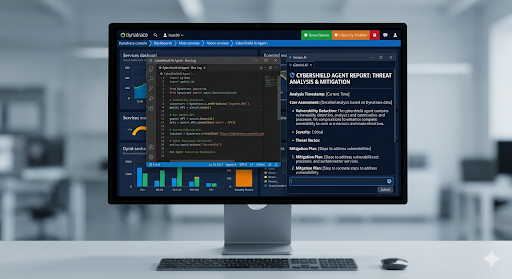

# 🛡️ CyberShield AI Agent
CyberShield AI is a next-generation cyber security and system monitoring dashboard built with Python and Streamlit, powered by the Google Gemini API, and integrated with Dynatrace telemetry.

---
## 📸 System Architecture & UI Demo

📢 **CyberShield AI Dashboard in Action:**
Below is the integrated system interface showcasing the core monitoring metrics, AI analysis reports, and dynamic threat mitigation options.




---

## ⚙️ Core Tech Stack
* **Frontend/UI:** Streamlit (Custom Premium Dark-Neon Cyberpunk Theme)
* **Core Logic:** Python
* **AI Engine:** Google Gemini API (For intelligent log parsing and automated threat reports)
* **Monitoring Integration:** Dynatrace Security Profiling

---

## 🌟 Key Features Tested & Verified

### 1. Dual Mode Operation
* **Demo Mode (For Presentation):** Actively simulated scenario showing **🔴 5 Active Vulnerabilities** and a **64% Safe (High Threat)** system warning to demonstrate real-world breach response.
* **Live Dynatrace Mode:** Real-time production status showing **🟢 0 Active Vulnerabilities** and a **100% Secure** environment status.

### 2. AI Threat Analysis Engine
* Generates on-demand structured security breakdowns via Gemini AI.
* Extracts critical logs (e.g., SQL Injections and Remote Code Execution alerts) with exact Severity IDs, Impact Indicators, and tailored Mitigation Action Plans.

---
## 🚀 Getting Started

Follow these steps to run the project locally:

1. **Clone the repository:**
   ```bash
   git clone [https://github.com/YOUR_USERNAME/YOUR_REPOSITORY_NAME.git](https://github.com/YOUR_USERNAME/YOUR_REPOSITORY_NAME.git)
   cd YOUR_REPOSITORY_NAME
pip install -r requirements.txt
GOOGLE_API_KEY=your_actual_api_key_here
python main.py

## 🔗 Submission Diagnostics
* **Deployment Setup:** Verified locally via Streamlit with secure remote tunneling frameworks.
* **UI Assessment:** Fully responsive layouts tailored for cybersecurity analyst operations.
